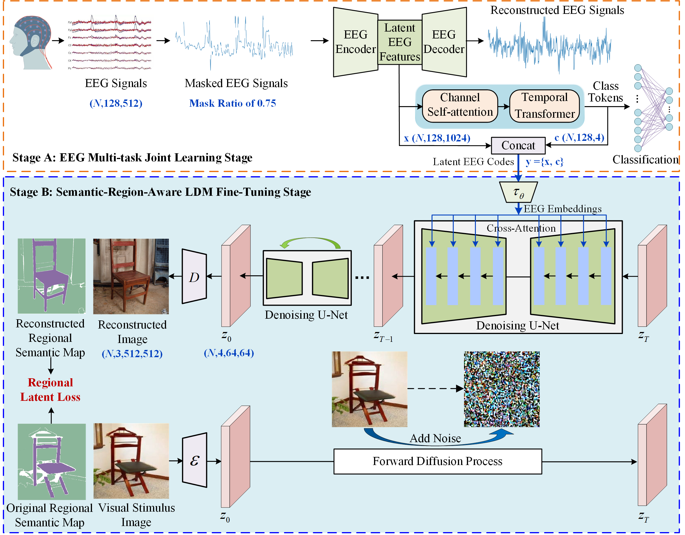

# EEG-Driven Natural Image Reconstruction with Semantic Region Awareness

### Abstract
Recent breakthroughs in AI-generated content (AIGC) technologies have made it possible to decode and reconstruct visual stimuli from electroencephalography (EEG) signals. Most existing methods extract global semantic information from EEG signals as the condition embedding to control a generative AI model, enabling it to generate candidate images that maintain global semantic consistency with those observed by subjects. However, relying solely on a global conditional control for image generation makes it difficult to recover the local spatial locations of objects and the spatial relationships among objects, which results in substantial discrepancies between the reconstructed images and the corresponding perceived ones. To address this issue, this paper proposes an EEG-driven natural image reconstruction with regional semantic awareness, termed ``EEG-RegionalDiff''. Specifically, it first extracts semantic- and location-aware latent EEG codes from EEG signals through the joint learning of masked EEG signal recovery and EEG-based visual classification. These latent EEG codes are then embedded into the latent diffusion model (LDM) as conditions to drive the reconstruction of the visual stimuli with  regional semantic awareness. To enhance local control capabilities over the semantic regions, the LDM is fine-tuned by introducing regional semantic maps as conditional constraints. Quantitative and qualitative comparison experiments demonstrate the superiority of the proposed EEG-RegionalDiff method, not only in achieving region-level semantic alignment but also in maintaining semantic dependencies among different object regions.

# Overview

# visualization_results in [EEG-ImageNet dataset](https://github.com/perceivelab/eeg_visual_classification)

# visualization_results in [Thing-EEG2 dataset](https://osf.io/hd6zk/)

## Acknowledgement
This code is built upon the publicly available code [Mind-vis](https://github.com/zjc062/mind-vis), [StableDiffusion](https://github.com/CompVis/stable-diffusion), [DreamDiffusion](https://github.com/bbaaii/DreamDiffusion) and [Segment-Anything](https://segment-anything.com/). Thanks these authors for making their excellent work and codes publicly available.
