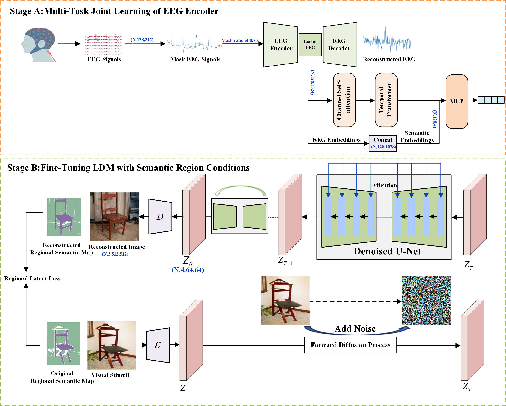

# EEG-Driven Natural Image Reconstruction with Semantic Region Awareness

### Abstract
With the recent breakthrough of AI-generated content (AIGC) technologies, it becomes possible to decode and reconstruct visual stimuli from electroencephalography (EEG). Most existing methods extract prompts with global semantics from EEG signals to drive a generative AI model to reconstruct candidate images that are semantically consistent with those observed by subjects. However, relying solely on global semantic prompts makes it difficult to recover the spatial locations of objects and the spatial relationships among objects in visual stimulus images, which results in substantial differences between the generated images and the corresponding perceived ones. To address this challenge, this paper proposes an EEG-driven natural image reconstruction with semantic region awareness. It first extracts semantic and location-aware latent EEG codes from EEG signals by a joint learning of masked EEG signal recovery and EEG visual classification. Then latent EEG codes are embedded into a Latent Diffusion Model (LDM) with semantic region conditional control for the semantic-region-aware image reconstruction. Quantitative and qualitative comparison experiments demonstrate the superiority of the proposed method not only in achieving semantic alignment of regions, but also in maintaining semantic dependencies among different object regions.

# Overview

# visualization_results in [EEG-ImageNet dataset](https://github.com/perceivelab/eeg_visual_classification)

# visualization_results in [Thing-EEG2 dataset](https://osf.io/hd6zk/)

## Acknowledgement
This code is built upon the publicly available code [Mind-vis](https://github.com/zjc062/mind-vis), [StableDiffusion](https://github.com/CompVis/stable-diffusion), [DreamDiffusion](https://github.com/bbaaii/DreamDiffusion) and [Segment-Anything](https://segment-anything.com/). Thanks these authors for making their excellent work and codes publicly available.
